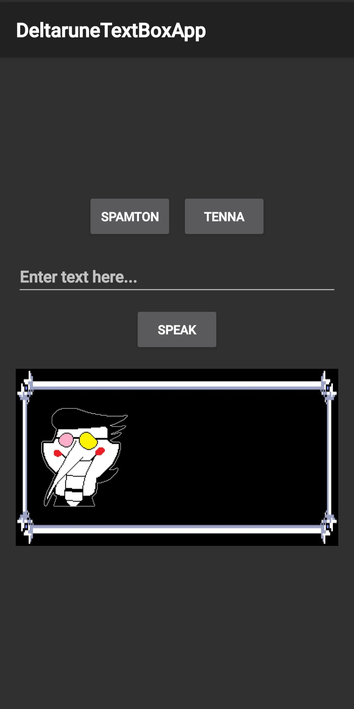

# Deltarune Textbox Simulator

This is a simple Android application that simulates the iconic textbox dialogue from the video game *Deltarune*. The app allows users to type in custom text, select a character, and watch as the text is animated on screen, complete with character-specific portraits and looping voice sounds.

## 🎭 Features

*   **Animated Text Display**: Text is typed out character-by-character, just like in the game.
*   **Character Selection**: Switch between **Spamton** and an alternate character (**Tenna**) at the tap of a button.
*   **Character Portraits**: The character's portrait sprite is displayed next to the text and updates based on the selected character.
*   **Synced Voice Sounds**: Each character's unique voice sound plays in a continuous loop for the duration of the text animation and stops when the text is complete.
*   **Custom Deltarune Font**: The app uses a custom font to accurately mimic the in-game text style.
*   **Custom App Icon**: Features a custom-designed app icon for a more polished look on your device.

## 📸 Screenshots

_

## ⚙️ How It Was Built

This application was developed natively for Android using **Kotlin** and the traditional **Android View System** (XML layouts).

*   **Core Language**: Kotlin
*   **Asynchronous Operations**: Kotlin Coroutines (`lifecycleScope`) are used to handle the text animation and sound playback without freezing the UI.
*   **UI**:
    *   Layouts are defined in `activity_main.xml`.
    *   `MediaPlayer` is used to handle the looping character voice sounds.
    *   Custom fonts and drawables are used for styling.

## 📥 How to Download and Install

Since this app is not on the Google Play Store, you can install it directly by "sideloading" the APK file.

### Step 1: Download the APK

Click the link below to download the latest version of the app.

[**Download**](<https://www.dropbox.com/scl/fo/8cyoq73981o5a18o3rdur/AOcY-TRyP6RIwjbFrI9XNU0?rlkey=vefs5szrfuf59fbsv493t3vc9&st=050hdx54&dl=0>)

### Step 2: Enable "Install from Unknown Sources"

By default, Android blocks installations from outside the Play Store for security. You need to grant permission to install the file.

1.  Download the `app-release.apk` file to your Android device.
2.  Open your file manager and tap on the downloaded file.
3.  A security pop-up will appear. It will say something like, "For your security, your phone is not allowed to install unknown apps from this source."
4.  Tap the **"Settings"** button on the pop-up.
5.  You will be taken to a new screen. Find your browser app (e.g., Chrome) or your file manager app in the list and enable the **"Allow from this source"** toggle.

### Step 3: Install the App

1.  Go back to the previous screen (or tap the downloaded APK file again).
2.  The installation prompt should now appear. Tap **"Install"**.
3.  Once it's finished, you can find the Deltarune Textbox app in your app drawer, complete with its custom logo!

---
